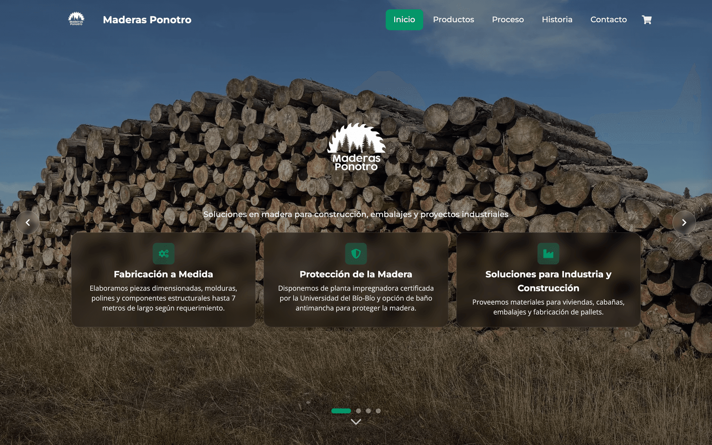
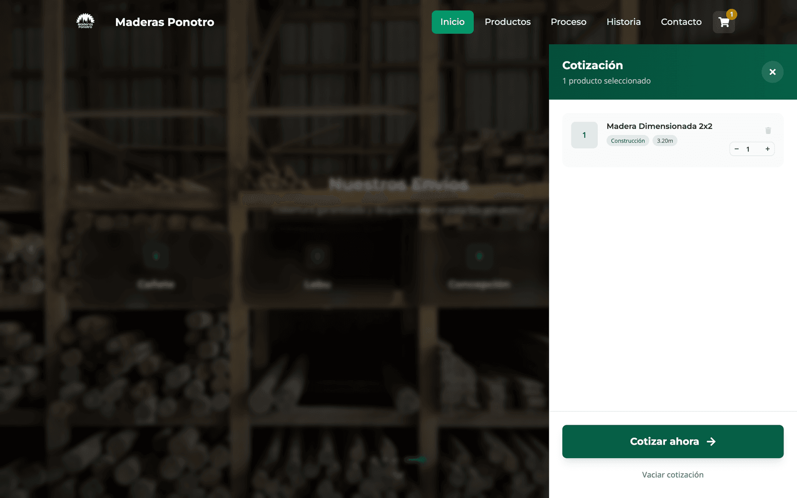
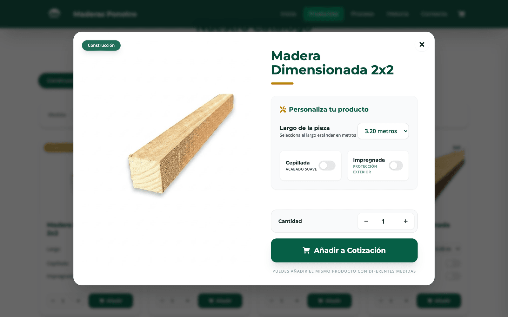
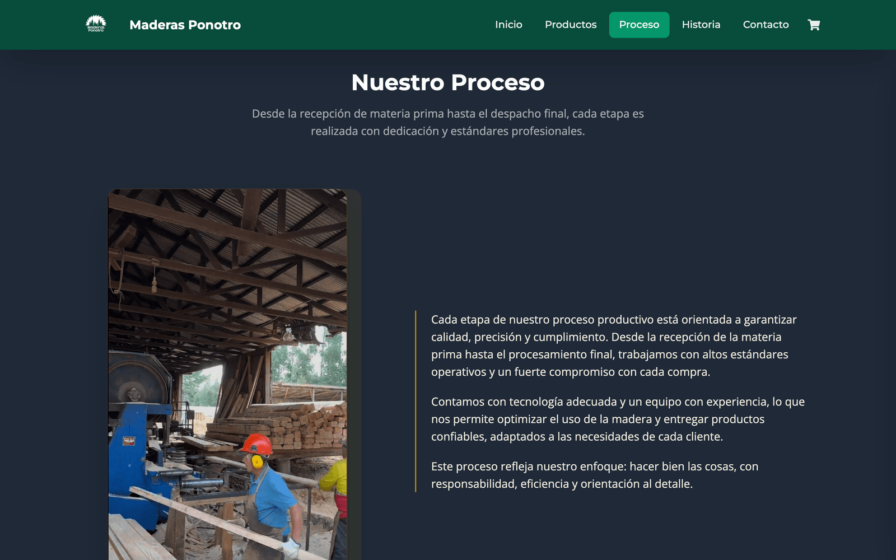
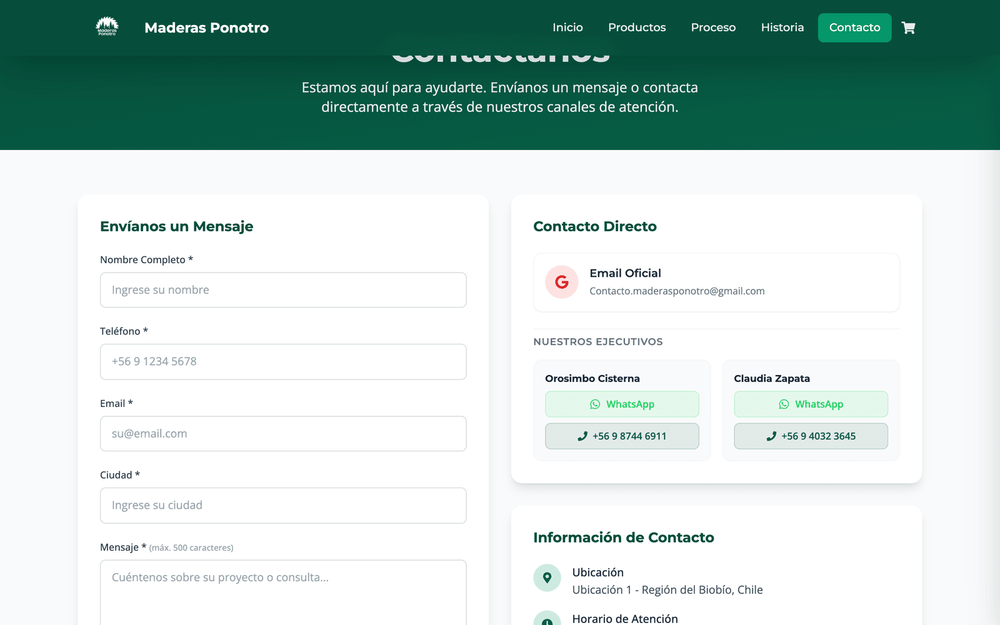
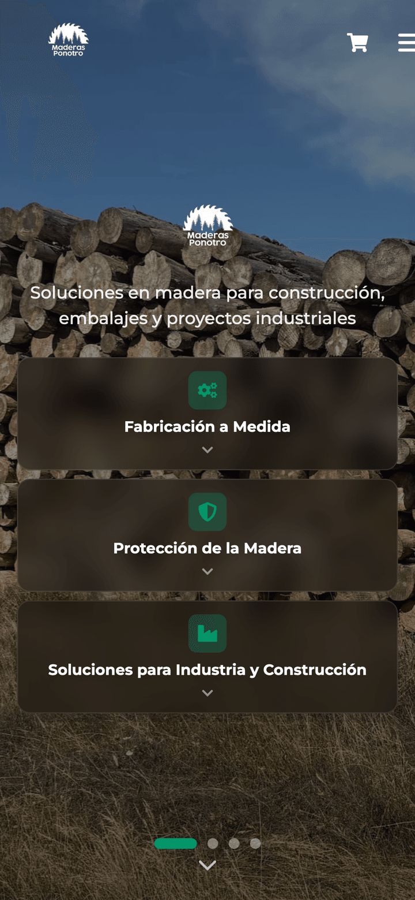

# Maderas Ponotro — Sitio Web Corporativo

> Sitio web corporativo y plataforma de cotizaciones para **Maderas Ponotro**, empresa chilena de elaboración e impregnación de maderas con más de 21 años de trayectoria en la Región del Bío-Bío.

[](https://maderasponotro.cl)
[](https://vitejs.dev/)
[](https://react.dev/)
[](https://tailwindcss.com/)

### [Ver sitio en vivo → maderasponotro.cl](https://maderasponotro.cl)

Proyecto desarrollado de forma independiente (freelance) — desde el levantamiento de requerimientos junto al cliente, el diseño y desarrollo, hasta el despliegue en producción y la entrega final.

---

## Capturas

| Hero & Catálogo | Carrito de Cotización |
|---|---|
|  |  |

| Detalle de Producto | Proceso Productivo |
|---|---|
|  |  |

| Formulario de Contacto | Vista Mobile |
|---|---|
|  |  |

---

## Características

- **SPA de página única** con navegación fluida por anclajes (`#inicio`, `#productos`, `#proceso`, `#historia`, `#contacto`) y *scroll spy* en navbar.
- **Hero carrusel inmersivo** a pantalla completa con 4 slides, soporte de gestos táctiles (swipe) y precarga LCP optimizada.
- **Catálogo de 14 productos en 4 categorías** con filtros dinámicos por tratamiento y medida, grilla adaptativa (1–4 columnas) y modales de detalle.
- **Carrito de cotización persistente** con `localStorage` que inyecta automáticamente los productos seleccionados al formulario de contacto.
- **Pedidos especiales (CTA)** para solicitudes fuera del catálogo estándar.
- **Formulario inteligente** con validaciones en tiempo real, envío vía **EmailJS** (sin backend propio) y resumen de cotización integrado.
- **Multi-sucursal con Google Maps embebido** y switch de ubicación dinámico.
- **Contacto directo** con WhatsApp, llamada telefónica y email mediante links profundos.
- **Animaciones scroll-reveal** con efecto stagger basadas en `IntersectionObserver`.
- **Performance ≥ 90 en Lighthouse** mediante compresión Brotli, optimización de imágenes WebP y code splitting agresivo.
- **Mobile-first** con breakpoints personalizados por altura de viewport.

---

## Stack tecnológico

| Categoría | Tecnología |
|---|---|
| **Framework UI** | React 18 |
| **Build tool** | Vite 6 |
| **Estilos** | Tailwind CSS 3 (design system custom) |
| **Iconos** | React Icons (fa, fa6, fi, hi) |
| **Estado global** | Context API + `useReducer` |
| **Persistencia** | `localStorage` |
| **Envío de emails** | EmailJS (dynamic import) |
| **Optimización build** | `vite-plugin-compression` (Brotli), `vite-plugin-image-optimizer` |
| **Linter** | ESLint 9 (flat config) |
| **Hosting** | Netlify (CI/CD continuo desde `main`) |

---

## Instalación local

### Requisitos
- Node.js ≥ 18
- npm ≥ 9

### Pasos

```bash
# 1. Clonar el repositorio
git clone <repo-url>
cd maderas-ponotro

# 2. Instalar dependencias
npm install

# 3. Configurar variables de entorno
cp .env.example .env
# Editar .env con las credenciales reales de EmailJS

# 4. Iniciar el servidor de desarrollo
npm run dev
```

El sitio quedará disponible en `http://localhost:5173`.

### Scripts disponibles

| Comando | Descripción |
|---|---|
| `npm run dev` | Servidor de desarrollo con HMR |
| `npm run build` | Build de producción (output: `dist/`) |
| `npm run preview` | Preview local del build de producción |
| `npm run lint` | Análisis estático con ESLint |

### Variables de entorno

| Variable | Descripción |
|---|---|
| `VITE_EMAILJS_SERVICE_ID` | ID del servicio EmailJS |
| `VITE_EMAILJS_TEMPLATE_ID` | ID de la plantilla EmailJS |
| `VITE_EMAILJS_PUBLIC_KEY` | Public key de EmailJS |

> En modo desarrollo, si las variables no están configuradas, el envío del formulario se **simula** (delay de 800 ms) para no bloquear el flujo de testing.

---

## Estructura del proyecto

```
maderas-ponotro/
├── public/                     # Assets estáticos (imágenes WebP, videos, logo)
│   ├── products/               # Catálogo de imágenes de productos
│   ├── videos/                 # Video del proceso productivo (.webm)
│   └── Slide 1-4.webp          # Fondos del hero
├── src/
│   ├── components/
│   │   ├── layout/             # Navbar, Footer, Hero, QuotationCart
│   │   ├── products/           # ProductCard, ProductGrid, ProductDetailModal, SpecialOrderCTA
│   │   ├── history/            # ProcessGallery, FounderProfile
│   │   ├── contact/            # ContactSection, ContactForm, ContactButtons, QuotationSummary
│   │   └── home/               # CallToAction
│   ├── context/
│   │   └── QuotationCartContext.jsx   # Estado global del carrito (useReducer)
│   ├── data/
│   │   └── products.js         # Catálogo estático (14 productos)
│   ├── constants/
│   │   └── heroData.js         # Datos del hero (cards, stats, valores, zonas de despacho)
│   ├── hooks/
│   │   └── useScrollReveal.js  # useScrollReveal + useScrollRevealStagger
│   └── utils/
│       ├── emailService.js     # EmailJS + CONTACT_INFO + link helpers
│       └── validation.js       # Validaciones del formulario
├── .unlighthouse/              # Reportes de auditoría Unlighthouse
├── netlify.toml                # Configuración de despliegue
├── vite.config.js              # Build config (compression + image optimizer + chunks)
└── tailwind.config.js          # Design system custom (colores, fuentes, animaciones)
```

---

## Decisiones técnicas

### ¿Por qué Vite + React SPA en lugar de Next.js?
El sitio es **una sola página de scroll continuo** sin rutas, sin contenido dinámico server-rendered, sin necesidad de SEO por página y sin backend propio. Levantar Next.js habría sumado complejidad (SSR/ISR, server components, API routes) sin beneficios reales. Vite ofrece un dev server casi instantáneo, build optimizado y todo el control necesario para una SPA estática servida desde CDN (Netlify).

### ¿Por qué Tailwind CSS?
- **Velocidad de iteración** durante las revisiones con el cliente: ajustar espaciados, colores o tipografías no requiere saltar entre archivos `.css`.
- **Design system tipado** en `tailwind.config.js`: la paleta forest/gold/cream y los breakpoints custom (`short`, `medium-h`) viven en un único lugar.
- **Bundle final mínimo** gracias al purge automático.

### ¿Por qué Context API + useReducer en lugar de Redux/Zustand?
El estado global se limita al carrito de cotización (~6 acciones: `ADD_ITEM`, `REMOVE_ITEM`, `UPDATE_QUANTITY`, `CLEAR_CART`, `TOGGLE_CART`, `CLOSE_CART`). Introducir Redux o Zustand para un solo dominio de estado habría sido sobreingeniería. Context + `useReducer` cubre el caso con cero dependencias adicionales.

### ¿Por qué EmailJS y no un backend propio?
El cliente necesitaba recibir cotizaciones por correo, no almacenarlas en una base de datos ni procesarlas con lógica de negocio. EmailJS elimina la necesidad de mantener un backend (y sus costos de hosting), conserva las credenciales fuera del repo mediante env vars y se carga dinámicamente para no inflar el bundle inicial.

### Optimización de performance
- **LCP**: precarga del primer slide del hero con `<link rel="preload">` + `fetchpriority="high"`.
- **Compresión**: build genera archivos `.br` (Brotli) para todos los assets.
- **Imágenes**: migración completa a WebP + plugin que recomprime en cada build a calidad 80.
- **Code splitting**: `React.lazy` + `<Suspense>` para todas las secciones bajo el fold; manual chunks separan `react-vendor` y `react-icons` para mejor cacheo entre deploys.
- **Carga diferida** de `emailjs-com` mediante dynamic import.
- **Persistencia segura**: el carrito se rehidrata desde `localStorage` con manejo defensivo de errores.

### Persistencia del carrito
Implementada con `localStorage` bajo la key `maderas-quotation-cart`. Los fallos de almacenamiento se manejan silenciosamente para no romper la UX cuando el usuario navega en modo privado o tiene la cuota llena.

---

## Auditorías de calidad

El proyecto incluye reportes generados con **[Unlighthouse](https://unlighthouse.dev/)** (`.unlighthouse/`), que audita el sitio en producción midiendo:

- **Performance** (Lighthouse ≥ 90)
- **Accesibilidad** (WCAG)
- **SEO** (meta tags, semántica HTML, mobile-friendly)
- **Best Practices**

Las auditorías se ejecutan contra el deploy en vivo (`maderasponotro.cl`) y permiten validar que las optimizaciones (compresión Brotli, WebP, code splitting, preload de LCP) tienen impacto real en producción y no solo en métricas locales.

---

## Despliegue

El sitio se despliega automáticamente en **Netlify** desde la rama `main`:

```toml
# netlify.toml
[build]
  publish = "dist"
  command = "npm run build"

[[redirects]]
  from = "/*"
  to = "/index.html"
  status = 200
```

Cada push a `main` dispara un build con `npm run build`, optimiza las imágenes, genera los assets comprimidos en Brotli y publica el contenido de `dist/` en la CDN global de Netlify.

---

## Sobre este proyecto

Desarrollado de forma **end-to-end como freelance** para un cliente real del sector industrial chileno:

- Levantamiento de requerimientos junto al cliente (ver `Especificacion3.0.md`).
- Diseño UX/UI, paleta de marca y design system.
- Desarrollo frontend completo.
- Optimización de performance (Lighthouse ≥ 90).
- Configuración de EmailJS y dominio.
- Despliegue en Netlify y entrega al cliente.

---

## Licencia

Proyecto privado desarrollado bajo contrato. Todos los derechos reservados.
